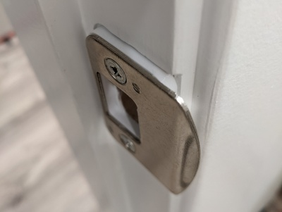
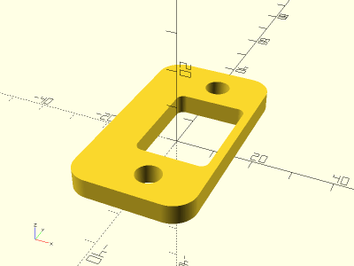

# Door Strike Spacer

<table>
<tr>
<td></td>
<td></td>
</tr>
</table>

A door strike spacer to improve latching for improperly installed doors. Default parameters sized for Schlage F series locksets. Made with OpenSCAD.

**Parameters:**

* `spacer_z_thickness` - spacer thickness, default 5mm
* Remaining dimension parameters in Advanced section

**Design:** [door_strike_spacer.scad](door_strike_spacer.scad)

**STL:** [door_strike_spacer.stl](stl/door_strike_spacer.stl)

**Recommended Print Settings:** PLA+, 0.20mm layer height, 100% infill, no supports

**Thingiverse:** https://www.thingiverse.com/thing:6085446

**License**: 
